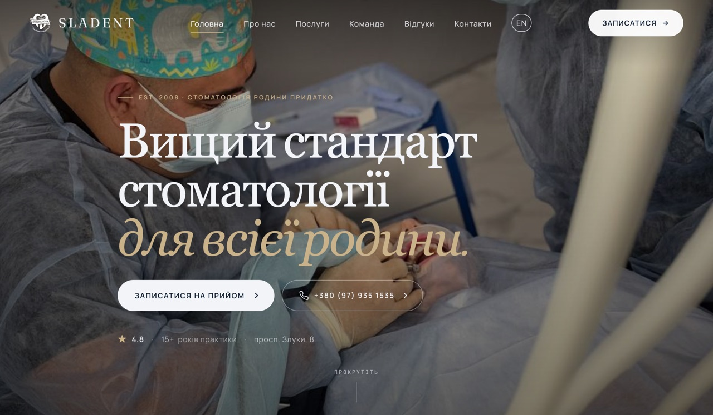

# Sladent

Website for [Sladent](https://sladent.com/), my family's dental clinic in Ternopil, Ukraine. I built it and keep it running.

**[sladent.com](https://sladent.com/)** · [English version](https://sladent.com/en/)

## What it is

Seven pages in Ukrainian and English: home, about, services, team, reviews, contact, and a 404. Every "book an appointment" button leads to the contact form, which runs on an Elfsight widget.

It is plain HTML, CSS and JavaScript on purpose. There is no build step and nothing to update, so the clinic's site keeps working without me touching it.

## Search

Most patients find a clinic through search, so the site does the local SEO work:

- Schema.org `Dentist` data with address, opening hours, coordinates and rating, plus an FAQ block
- `hreflang` between the Ukrainian and English pages, with `x-default`
- `sitemap.xml` and `robots.txt`
- A 301 from the Netlify subdomain to `sladent.com`, so only one domain gets indexed

[SEO.md](SEO.md) is the plan for everything outside the code, starting with the Google Business Profile.

## Running it

Open `index.html` in a browser. It deploys to Netlify as static files with no build settings.
